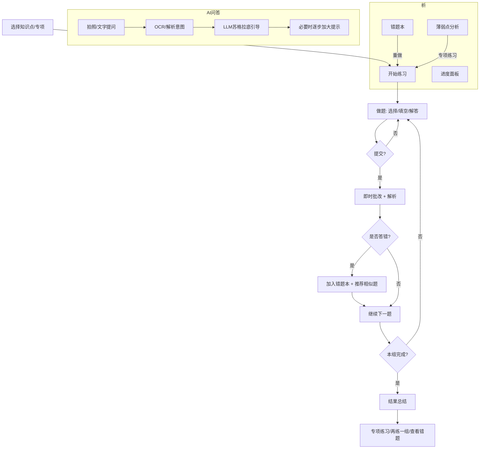
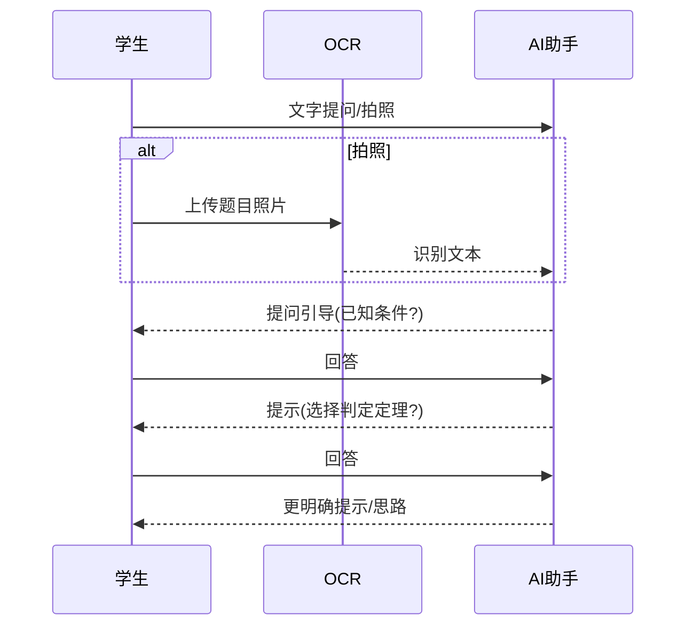
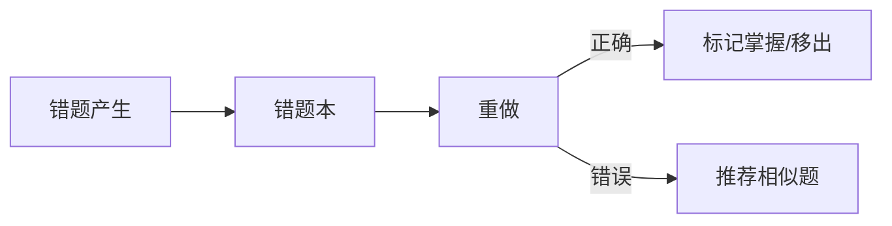

# Math智学 (MVP) — 交互逻辑与流程规范

版本: v1.0
覆盖模块：智能练习引擎、即时批改、相似题推荐、AI 问答助手、错题与薄弱点分析、进度面板

---

## 1. 主流程总览



---

## 2. 练习引擎（自适应）

规则目标：在 5~10 题内完成一次“测-训-评-补”的闭环。

伪代码：

```js
// 初始化
let difficulty = 'medium';
let streakRight = 0;
let streakWrong = 0;

function onAnswer(result) {
  if (result.correct) {
    streakRight++; streakWrong = 0;
  } else {
    streakWrong++; streakRight = 0;
    addToMistakeBook(result.questionId);
  }

  // 难度自适应
  if (streakRight >= 2) {
    difficulty = harder(difficulty); // medium -> hard
    streakRight = 0;
  }
  if (streakWrong >= 2) {
    difficulty = easier(difficulty); // medium -> easy
    recommendSimilar(result.questionId);
    streakWrong = 0;
  }
}
```

边界：
- 首次练习固定以中等难度起步；
- 题目类型按知识点覆盖：选择/填空优先，解答题在 MVP 可半自动批改；
- 每组题量默认 5 题，用户可选 8/10；
- 组内避免重复题，错题优先在相似题中复现考点。

---

## 3. 即时批改与解析
- 选择/填空：标准答案精确匹配；
- 解答题（MVP）：关键步骤点匹配（人工标注集 + 简化规则），给出部分得分与关键提示；
- 解析展示顺序：结果徽标(✅/❌) -> 正确答案 -> 关键思路 -> 详细步骤 -> 举一反三（相似题）；
- 交互限制：提交后才能看解析；
- 无网/超时：提示“网络不稳定”，支持重试；

---

## 4. AI 问答助手（苏格拉底式引导）

### 4.1 对话策略
- 默认不直接给出最终答案，优先提问式引导；
- 学生连续卡住（如 2 次），逐步增加提示力度；
- 若识别为作业题，提示“请先独立思考”；
- 每日 10 次额度，展示剩余次数；



错误与降级：
- OCR 失败：提供重拍与手动输入备选；
- LLM 限流/失败：提示稍后重试 + 提供“类似题讲解/示例”兜底内容；

---

## 5. 错题本与专项练习循环
- 自动归档：每次错误题目记录入错题本（题目ID、错误次数、最近时间）；
- 重做机制：
  - 重做正确：错误次数-1 或标记为“已掌握”；
  - 多次正确：可移出错题本；
- 专项练习：基于薄弱知识点（正确率<阈值，如 60%）自动推荐 5~10 题；



---

## 6. 学习进度与周报
- 实时数据：今日学习时长、连续学习天数、本周练习题数；
- 趋势数据：整体正确率趋势图、知识点掌握度条；
- 周报：每周生成一次（学习天数、练习量、正确率、薄弱点、建议与专项练习入口）；

---

## 7. 系统状态与边界
- 权限：首次使用拍照需申请相机权限；拒绝后提供前往系统设置指引；
- 网络：弱网/离线显示轻量占位，支持离线浏览已缓存的“知识点讲解”；
- 隐私：拍照题目不保存原图，仅保存识别文本；
- 防沉迷：学习提醒与“每组短时练习”设计；

---

## 8. 事件追踪（与指标对齐）
建议埋点：
- app_open，tab_switch
- practice_start, practice_submit, practice_result, practice_summary_view
- ai_ask_start, ai_ask_success, ai_ask_fail, ai_quota_exceed
- mistake_add, mistake_retry, mistake_mastered
- weakness_entry_click, targeted_practice_start
- progress_view, weekly_report_view

与 PRD 指标映射：留存（tab_switch/每日活跃）、活跃度（practice_start/ai_ask_*）、学习效果（practice_result/正确率）

---

## 9. 非目标（MVP 不包含）
直播、社区/社交、多学科、家长端、积分/排行、打印等。
