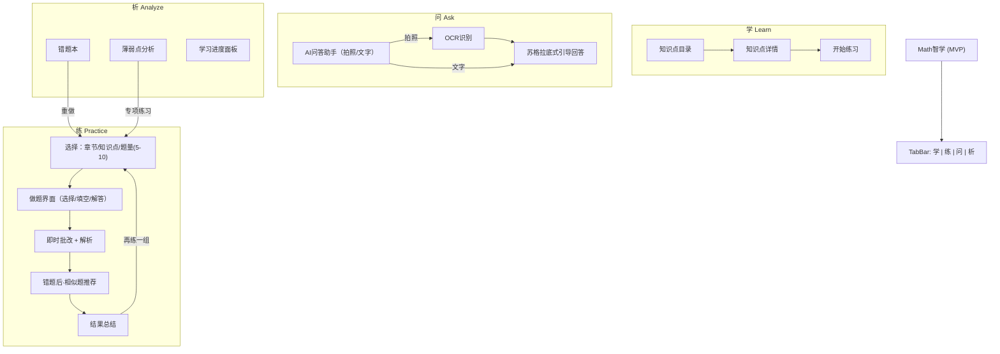

# Math智学 (MVP) — UI 线框图与导航结构

版本: v1.0
基于文档: PRD_初中数学AI学习APP.md (MVP: 学/练/问/析)

---

## 1. 设计目标与原则
- 面向初二学生，信息清晰、操作简单、反馈即时
- 聚焦 MVP 功能：知识点学习、智能练习、AI 问答、错题本+薄弱点分析、学习进度
- 引导式体验：从“不会—>会做—>会举一反三—>复盘巩固”闭环
- 一致性与可达性：统一组件、强调空/加载/错误状态的友好提示

---

## 2. 全局导航与信息架构（IA）

- 底部 4 个一级标签：
  - 学：知识点目录、知识点详情（含视频/文字/例题）、开始练习
  - 练：练习配置、做题页（即时批改+解析）、相似题推荐、结果总结
  - 问：AI 问答助手（拍照/文字，苏格拉底式引导，展示每日剩余次数）
  - 析：错题本、薄弱点分析、学习进度面板（趋势/掌握度）

---

## 3. 关键页面线框图（ASCII）

说明：以下为低保真线框，展示信息布局与主要交互元素，实际视觉以后续 UI 规范细化。

### 3.1 首页（仪表盘，非必需，可作为“学”默认页拓展）

+--------------------------------------------------+
| AppBar: Math智学              (🔔) 通知            |
+--------------------------------------------------+
| KPI 卡片: 今日学习 20m | 连续学习 3 天            |
| 迷你图: 本周正确率趋势 ▄▅█▆█                     |
+--------------------------------------------------+
| 推荐卡片: 继续上次练习  三角形-全等判定  5题      |
| [开始]                                          |
+--------------------------------------------------+
| 快捷入口: 知识点目录 | 专项练习 | AI问答 | 错题本  |
+--------------------------------------------------+
| Tab: 学 | 练 | 问 | 析                            |
+--------------------------------------------------+

空状态：首次使用显示“选择知识点开始学习”。

---

### 3.2 学：知识点目录

+--------------------------------------------------+
| AppBar: 学（知识点目录）         (🔍 搜索)         |
+--------------------------------------------------+
| 章节折叠列表：                                        |
| ▸ 第一章 三角形                                     |
|   - 三角形的边                                      |
|   - 三角形的内角和外角                               |
|   - 全等三角形                                      |
|   - 全等三角形的判定 (SSS/SAS/ASA/AAS)              |
| ▸ 第二章 整式的乘除                                 |
| ▸ 第三章 因式分解                                   |
| ▸ 第四章 分式                                       |
| ▸ 第五章 二次根式                                   |
+--------------------------------------------------+
| Tab: 学 | 练 | 问 | 析                            |
+--------------------------------------------------+

交互：
- 点击知识点 -> 进入“知识点详情”
- 长按知识点 -> 快捷开始练习（默认 5 题，中等难度）

---

### 3.3 学：知识点详情

+--------------------------------------------------+
| AppBar: 全等三角形的判定 (SSS/SAS/ASA/AAS)         |
+--------------------------------------------------+
| 文本讲解（重点/难点标注）                           |
| [3~5分钟短视频]  ▶ 播放                            |
| 典型例题 x2~3：                                    |
|  - 例1：…  [查看解析]                              |
|  - 例2：…  [查看解析]                              |
+--------------------------------------------------+
| 主按钮: 开始练习                                    |
+--------------------------------------------------+
| Tab: 学 | 练 | 问 | 析                            |
+--------------------------------------------------+

---

### 3.4 练：练习配置（可从“学/析”跳入）

+--------------------------------------------------+
| AppBar: 开始练习                                    |
+--------------------------------------------------+
| 选择章节/知识点： [全等三角形判定] (可改)           |
| 题量： [5]  (5/8/10)                               |
| 难度： [自适应] (基础/中等/拔高/自适应)             |
+--------------------------------------------------+
| 次按钮: 查看错题 | 主按钮: 开始                     |
+--------------------------------------------------+

---

### 3.5 练：做题页（选择/填空）

+--------------------------------------------------+
| 题目 2/8      难度: 中等                           |
+--------------------------------------------------+
| [题干区域，支持公式渲染]                           |
|  (A) 选项A                                        |
|  (B) 选项B                                        |
|  (C) 选项C                                        |
|  (D) 选项D                                        |
+--------------------------------------------------+
| [提交]  [跳过]                                     |
+--------------------------------------------------+
| 提交后：                                           |
| ✅/❌  正确/错误  |  正确答案: C                    |
| 解析：分步讲解…                                    |
| 行为：错题 -> 自动加入“错题本”；推荐“相似题”       |
| [做相似题]  [下一题]                                |
+--------------------------------------------------+

状态：
- 提交前不可看解析；提交后展示解析+相似题；
- 连续对/错触发难度上/下降（见交互逻辑）。

---

### 3.6 练：做题页（解答题）

+--------------------------------------------------+
| 题目 4/5      难度: 中等                           |
+--------------------------------------------------+
| [题干 + 图示]                                      |
| [步骤输入区：分步作答/拍照上传（MVP可选）]          |
+--------------------------------------------------+
| [提交]                                            |
+--------------------------------------------------+
| 提交后（MVP）：                                    |
|  - 关键要点匹配结果（人工标注/半自动）              |
|  - 解析与提示                                      |
|  - 评分（试行）                                    |
+--------------------------------------------------+

---

### 3.7 练：结果总结

+--------------------------------------------------+
| 本组练习完成                                       |
+--------------------------------------------------+
| 正确率：72%      用时：12m                         |
| 错题：3 题  | 易错知识点：全等判定                 |
| 建议：做 5 题“全等判定·基础”专项练习               |
+--------------------------------------------------+
| [再练一组]   [去做专项练习]   [查看错题]            |
+--------------------------------------------------+

---

### 3.8 问：AI 问答助手

+--------------------------------------------------+
| AppBar: AI 问答助手   每日剩余：7/10                |
+--------------------------------------------------+
| 消息区（多轮对话，苏格拉底式引导）                 |
| 你：这道全等三角形证明题怎么做？                   |
| AI：先说说已知条件？两边相等还是角相等？           |
+--------------------------------------------------+
| [📷 拍照]  [公式键盘]  [输入框……]  [发送]            |
+--------------------------------------------------+
| Tip：作业请先独立思考，AI 仅做引导，不直接给答案。  |
+--------------------------------------------------+

错误/限制：
- 超额：提示达到每日 10 次上限；
- OCR 失败：提示重拍或改用文字输入。

---

### 3.9 析：错题本列表

+--------------------------------------------------+
| AppBar: 错题本                                     |
+--------------------------------------------------+
| 筛选：章节/知识点/题型  | 排序：最近/错误次数       |
| [题目卡片]  三角形-全等判定   错误 2 次  (▶ 重做)   |
| [题目卡片]  因式分解-十字相乘   错误 1 次           |
+--------------------------------------------------+
| 空状态：暂无错题。去做练习试试？ [开始练习]         |
+--------------------------------------------------+

---

### 3.10 析：错题详情与重做

+--------------------------------------------------+
| 题干 + 你的历史答案 + 解析                          |
+--------------------------------------------------+
| [再做一次]  [移出错题本]  [标记已掌握]               |
+--------------------------------------------------+

逻辑：
- 再做正确 -> 错题计数下降/标记已掌握；
- 多次正确 -> 可移出错题本。

---

### 3.11 析：薄弱点分析

+--------------------------------------------------+
| 本周薄弱知识点                                     |
+--------------------------------------------------+
| 全等三角形证明（正确率 45%）   [做专项练习 10 题]    |
| 因式分解-十字相乘（正确率 58%） [做专项练习 8 题]    |
+--------------------------------------------------+

---

### 3.12 析：学习进度面板

+--------------------------------------------------+
| 今日学习：20 分钟   连续：3 天                      |
| 本周练习：87 题     平均正确率：72%                 |
| 趋势图：正确率（周）                               |
| 掌握度：                                           |
|  - 三角形  ████████░░  80%                         |
|  - 整式乘除 ██████░░░░  60%                         |
|  - 因式分解 ███░░░░░░░  30%                         |
+--------------------------------------------------+

---

## 4. 通用交互约定
- 提交后可见解析；提交前隐藏正确答案；
- 错题自动加入错题本；做错后弹出“相似题”；
- 自适应难度：
  - 初始中等；连续答对 -> 难度+1；连续答错 -> 难度-1 并推荐基础题；
  - 在 5~10 题的短练习内完成闭环；
- 空/加载/错误状态标准化文案与占位；
- 权限提示：首次拍照询问相机权限，拒绝后引导到设置。

---

## 5. 合规与提示
- 数据隐私：不保存拍照原图，仅保存识别文字；
- 作业提醒：弱化“直接给答案”，强调引导；
- 面向未成年：用词简单，避免复杂社交元素。

---

## 6. 非目标（MVP 不包含）
- 直播课、社区/社交、多学科、家长端、积分/排行榜、打印

